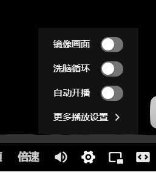
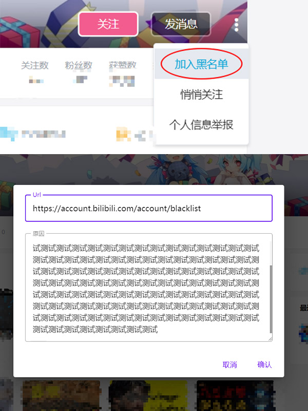
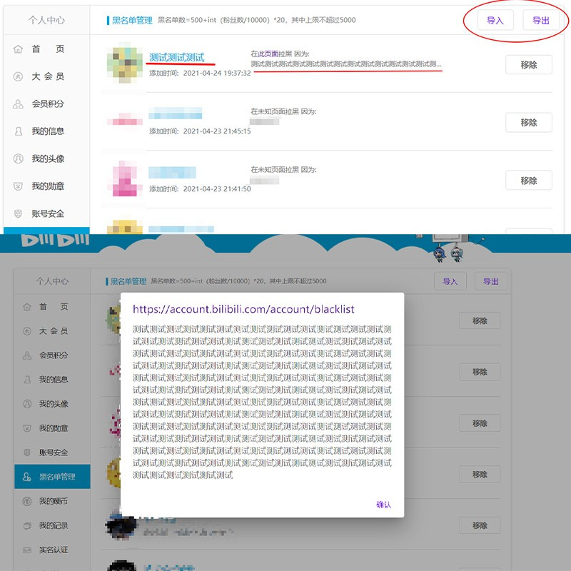
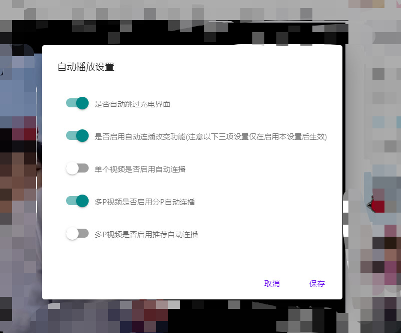
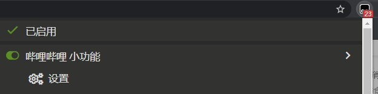

修复[哔哩哔哩 为什么拉黑](https://greasyfork.org/zh-CN/scripts/31615-bilibili-why-blocked)脚本，增加用户空间页拉黑添加原因功能，并添加一些小功能(自动跳过充电页面，单P视频是否自动播放推荐视频，多P视频是否自动播放分P，多P视频是否自动播放推荐视频，番剧是否自动连播)，可能有BUG，如果不工作，先刷新试试

[项目地址](https://github.com/MrSTOP/BilibiliSmallTools)

**0.4.6.2可能引入了破坏性更改，为避免问题，有关自动播放的设置已被重置，请重新设置（不影响已保存的拉黑原因）**

**0.5.0.0添加对稍后再看页面支持([SingletonData.js](https://greasyfork.org/scripts/31539-singletondata/code/SingletonData.js)依赖已被[作者](https://github.com/cologler/)删除，从过去保存的文件中恢复，可能会引发问题)**

如果启用了番剧自动切集功能，视频或番剧播放页面中播放器的设置窗口可能会短暂弹出一下（视频播放器的设置是动态加载的，为实现自动设置功能必须这样操作 PS:通常应该不会出现）

评论区拉黑会记录被拉黑用户评论及评论所在网址

用户空间拉黑会记录进入用户空间前的网址并可以填写及查看原因

查看和导入导出数据，点击拉黑原因可以在对话框中查看

小功能设置按钮

功能设置对话框

脚本管理器设置入口

