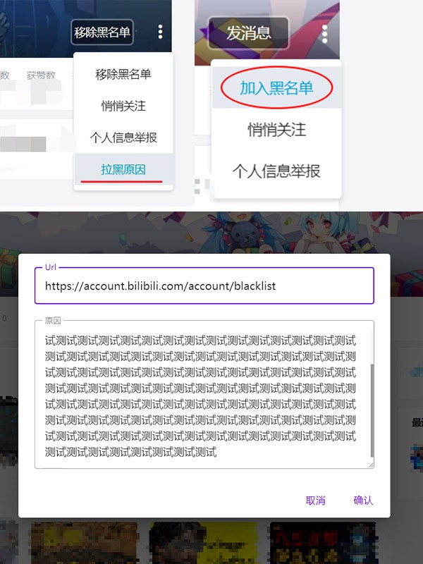
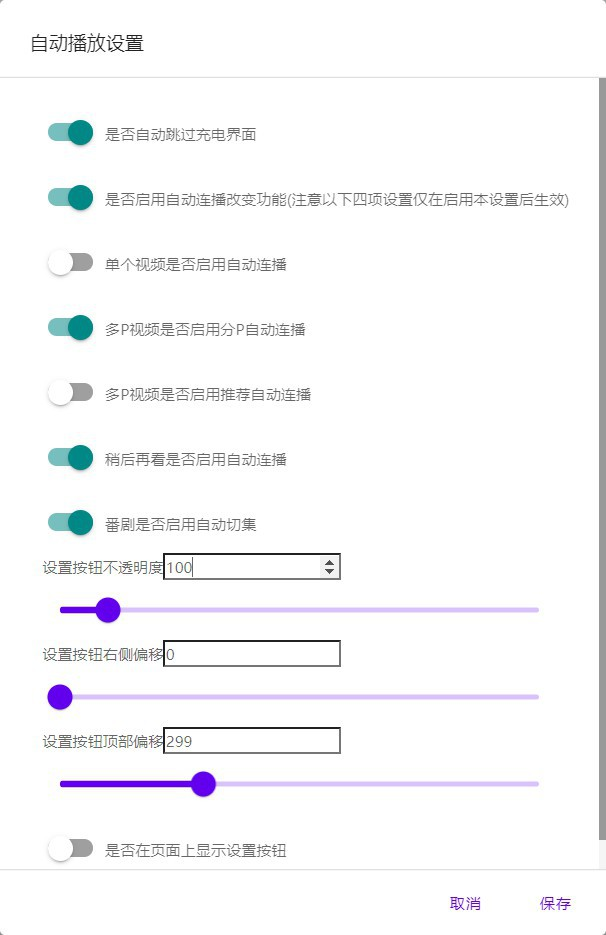

修复[哔哩哔哩 为什么拉黑](https://greasyfork.org/zh-CN/scripts/31615-bilibili-why-blocked)脚本，增加用户空间页拉黑添加原因功能，并添加一些小功能(自动跳过充电页面，单P视频是否自动播放推荐视频，多P视频是否自动播放分P，多P视频是否自动播放推荐视频)，可能有BUG，如果不工作，先刷新试试

[项目地址](https://github.com/MrSTOP/BilibiliSmallTools)

评论区拉黑会记录被拉黑用户评论及评论所在网址

用户空间拉黑会记录进入用户空间前的网址并可以填写原因

查看和导入导出数据，点击拉黑原因可以在对话框中查看

小功能设置按钮

功能设置对话框

